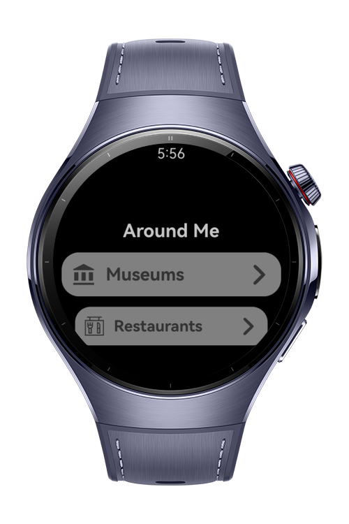
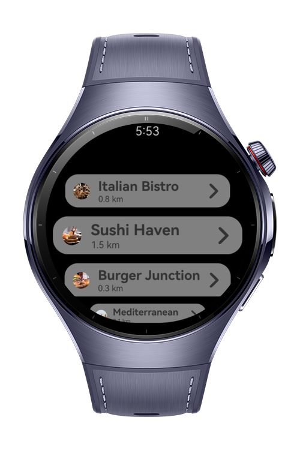
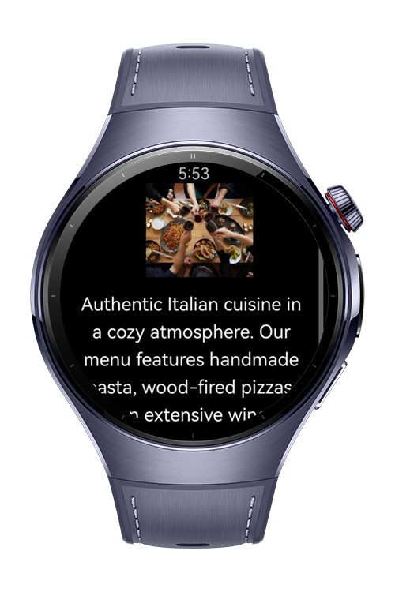

> **Note:** To access all shared projects, get information about environment setup, and view other guides, please visit [Explore-In-HMOS-Wearable Index](https://github.com/Explore-In-HMOS-Wearable/hmos-index).

# Travel App

This app showcases museum and restaurant listings with detailed descriptions, venue recommendations with images, hotel
information, and smooth navigation between menus, developed for **HarmonyOS NEXT** using **ArkTS.**

# Preview

<div>
  
  
  
  
</div>

# Use Cases

The app is designed to provide an engaging way for users to explore cultural, dining, and travel information, making it
easier to discover venues, view recommendations, and navigate between different categories on HarmonyOS NEXT. The
following are the featured use cases:

1. Museum and Restaurant Listings: Users can browse curated lists of museums and restaurants, each with detailed
   descriptions to help plan visits.
2. Venue Recommendations with Images: The app provides visual recommendations for popular venues, giving users an
   immersive preview of attractions.
3. Hotel Information Access: Travelers can quickly check available hotel options, enhancing convenience for trip
   planning.
4. Smooth Menu Navigation: The app demonstrates structured navigation between sections like museums, restaurants, and
   hotels, showcasing best practices in ArkTS development.
5. UI/UX Inspiration: Designers and developers can reference the app for structuring multi-category listings with both
   text and visual content.
6. Optimized for HarmonyOS NEXT: Built using ArkTS, the app demonstrates smooth performance and compatibility with
   HarmonyOS NEXT devices, including wearables and mobile.

# Tech Stack

- **Languages**: ArkTS
- **Frameworks**: HarmonyOS SDK 5.1.0(18)
- **Tools**: DevEco Studio Version 5.1.0.849
- **Libraries**:
    - `@kit.AbilityKit`
    - `@kit.ArkUI`
    - `@kit.PerformanceAnalysisKit`

# Directory Structure

```
entry/src/main/ets/
├── core/                               # Core business logic and utilities
│   ├── constants/                      # App-wide constants
│   │   └── NumberCons.ets              # Numeric constants
│   │
│   ├── models/                         # Data models
│   │   └── CategoryItemModel.ets       # Model for categories (museum, restaurant, etc.)
│   │
│   └── services/                       # Service layer
│       ├── BaseViewModel.ets           # Base ViewModel (shared logic)
│       └── RouteService.ets            # Navigation / routing service
│
├── entryability/                       # Main entry ability (app lifecycle)
│   └── EntryAbility.ets
│
├── entrybackupability/                 # Backup/restore ability (state persistence)
│   └── EntryBackupAbility.ets
│
└── ui/                                 # UI-related files (pages, viewmodels, widgets)
    ├── pages/                          # App screens
    │   ├── Index.ets                   # Home page
    │   ├── MuseumDetailPage.ets        # Museum details page
    │   ├── Museums.ets                 # Museums list page
    │   ├── RestaurantDetailPage.ets    # Restaurant details page
    │   └── Restaurants.ets             # Restaurants list page
    │
    ├── viewmodels/                     # ViewModels for each page (MVVM)
    │   ├── IndexViewModel.ets          # Home page ViewModel
    │   ├── MuseumsViewModel.ets        # Museums list/detail ViewModel
    │   └── RestaurantsViewModel.ets    # Restaurants list/detail ViewModel
    │
    └── widgets/                        # Reusable UI components
        ├── AppBar.ets                  # Custom AppBar component
        └── SingleMenuItem.ets          # Reusable menu item component
```

# Constraints and Limitations

## Suported Devices

- Huawei Watch 5

# License

**Travel App** is distributed under the terms of the MIT License
See the [LICENSE](./LICENSE) for more information.